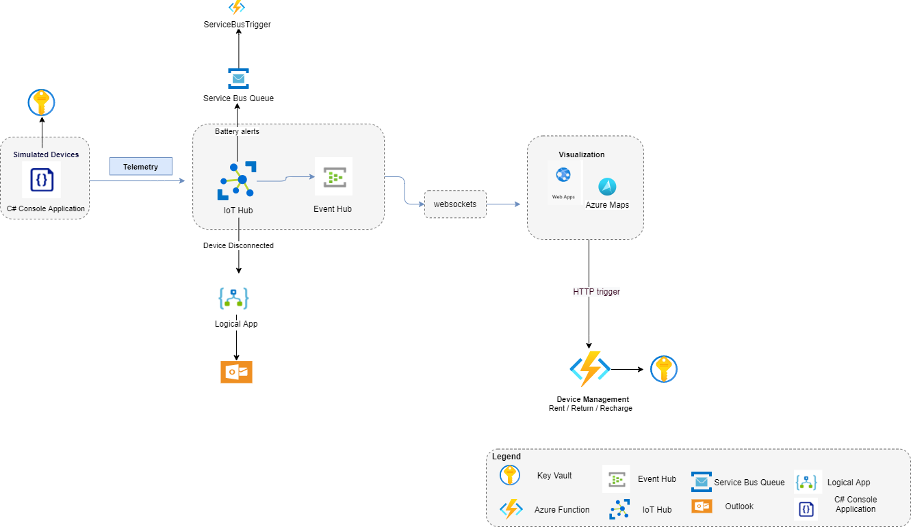

# Introduction 
This project is based on [Lime Project](https://dev.azure.com/cseonboarding/TechOnboarding/_git/TechOnboarding?path=%2Fcookbook%2Fcases%2Flime.md&_a=preview)

The objectives of this project is to build a foundation of core Azure services, following [Engineering Fundamentals](https://microsoft.github.io/code-with-engineering-playbook/).

# Problem statement
Lime is an e-scooter renting company. They plan to build a fleet of scooters that their customers can use to move from one point to another. To access Lime's service a user must download their app, check in with a scooter, ride to their destination and then check out. The rental fee will automatically be deducted from their wallet, while Lime will take care of charging depleted scooters and maintaining a functional fleet. 

# Requirements:
Functional requirements:
- Simulated scooters which send information (Battery level, Location, Status, Device Id) to the cloud in a scheduled manner.
- An operator can visualize the battery levels of their scooters.
- A user can visualize scooters on a map along with their status (Available / Rented / Recharging / Unavailable).
- A user can rent and return a scooter through a web application.
- A scooter can be set on recharging mode by an operator / automatically, when the battery drops under a certain level.

Non-functional requirements:
- Development will follow Agile methodology - Azure DevOps boards, daily Standups etc.
- Code will be checked into the main branch (adina-main) through PRs.
- Each PR needs at least one approval.
- CI/CD pipelines.
- The could will be covered with Unit Tests (and other tests, if possible).
- All secrets are stored and accessed in a secure way.
- The Azure resources will be deployed via IaC tool (Bice / Terraform).

# Proposed Architecture:

| Feature  | Implementation  |
|---|---|
|1.	Visualize battery level in real time|  <ul><li>Send telemetry from the device to IoT Hub with information which includes the battery level of a scooter.</li><li>The messages contain Device ID, Status (Available / Rented / Recharging / Unavailable), Latitude, Longitude and Battery level.</li><li>The messages are enriched with a property ("batteryAlert") that indicates whether the battery is below a certain threshold.</li><li> The messages are routed to the default endpoint in IoT Hub ("messages/events") which is compatible with Event Hub.</li><li> Telemetry is read in real time through the EventHubConsumerClient with a dedicated ConsumerGroup by using websockets in a NodeJs application.</li>We decided not to store in a database the battery level as it is an information available in real time.</ul>|
| 2. Visualize scooter location | <ul><li>Similar to the approach above, the messages sent from the scooters will include also Latitude and Longitude details. Azure Maps will be used to display the position on the map. </li></ul>|
| 3. Automatically disable the scooter| <ul><li>Telemetry messages received at the IoT Hub with a property ("batteryAlert="true") that indicates the battery is below a certain threshold will be re-routed to a custom endpoint. Such messages will be sent to a Service Bus Queue. An Azure Function with ServiceBusTrigger will exist, which will set the status of that scooter to "Recharging". A Direct Method will be invoked (if the properties are stored in memory) or the status will be updated on the reported properties in Device Twin.|
|4. Store Iot Hub and device connection string securely | <ul><li>Secrets will be stored in Azure key vault.</li></ul>

# Project
The projects consists of:
1.	[SimulatedDeviceScooter](https://dev.azure.com/OnboardingMay2022/_git/OnboardingMay2022?path=/SimulatedDeviceScooters&version=GBadina/spike):

A console application which simulates scooters by sending telemetry data (battery level) to IoT Hub and registers direct method on devices.

2.	[FrontEndApplication](https://dev.azure.com/OnboardingMay2022/_git/OnboardingMay2022?path=/FrontEndApplication&version=GBadina/spike): 

A NodeJs application which displays the battery level in real time. Users can rent/return a scooter. Operators can recharge a scooter.

3.	[DeviceManagement](https://dev.azure.com/OnboardingMay2022/_git/OnboardingMay2022?path=/DeviceManagement&version=GBadina/spike)
Azure Function application with HTTP GET triggers which invokes direct method on devices.

# Build and Test
See the README section from each project mentioned above.

# Deploy
The DeviceManagement application (Function App) will be deployed to App Service through a continous delivery pipeline ([adina-azure-function-CI-CD-pipeline](https://dev.azure.com/OnboardingMay2022/OnboardingMay2022/_build?definitionId=4)). The pipeline contains 5 stages and the YAML file can be found [here](https://dev.azure.com/OnboardingMay2022/_git/OnboardingMay2022?path=/pipelines/deploy/azure-function-build-deploy-pipeline.yml):.
1. Validate the Bicep file (/infrastructure/infra.bicep) which describes the Azure resources needed. (Storage Account, Function App, App Insights, Hosting Plan). It also displays the results of "what-if" operation which previews the changes.
2. Manual Validation stage which waits for a confirmation of the previous "what-if" operation.
3. Deploy the Azure Resources.
4. Run the code and the tests, package the artficat in a ZIP file.
5. Download the artifact and deploy.
